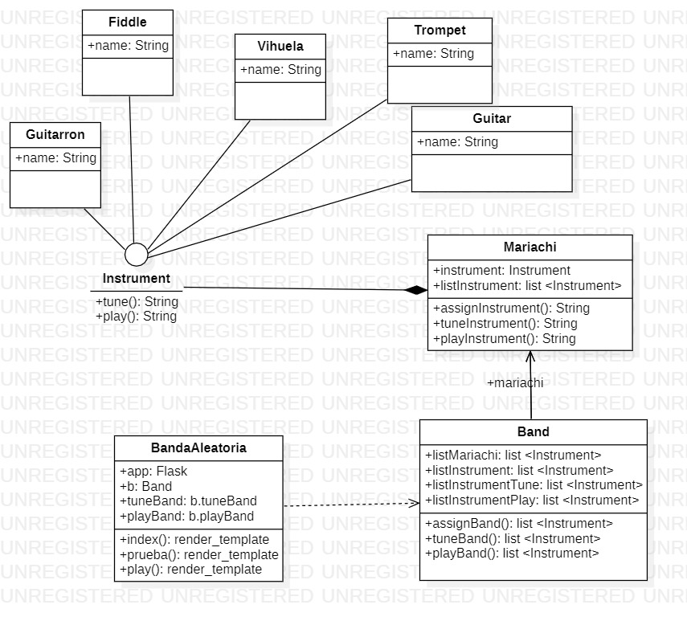

# **BANDA DE MARIACHIS**

- [**BANDA DE MARIACHIS**](#banda-de-mariachis)
  - [**INTEGRANTES**](#integrantes)
  - [**¿CÓMO EJECUTAR?**](#cómo-ejecutar)
    - [**PASOS PARA INSTALAR PYTHON**](#pasos-para-instalar-python)
      - [**PARA WINDOWS O MacOS**](#para-windows-o-macos)
      - [**PARA LINUX/UNIX**](#para-linuxunix)
    - [**PASOS PARA INSTALAR FLASK**](#pasos-para-instalar-flask)
  - [**PRINCIPIOS APLICADOS**](#principios-aplicados)
    - [**1.SINGLE RESPONSABILITY**](#1single-responsability)
    - [**2.OPEN - CLOSED**](#2open---closed)
    - [**3.LISKOV**](#3liskov)
  - [**CÓDIGO**](#código)
    - [**INTERFAZ INSTRUMENT**](#interfaz-instrument)
    - [**CLASES DE LOS INSTRUMENTOS**](#clases-de-los-instrumentos)
    - [**CLASE MARIACHI**](#clase-mariachi)
    - [**CLASE BAND**](#clase-band)
    - [**CLASE APP**](#clase-app)

## **INTEGRANTES**

- Andrés David Beltrán Rojas 20182020090

- Laura Tatiana Ramírez Rodríguez 20182020098

- Javier Santiago Borbón 20182020085

## **¿CÓMO EJECUTAR?**

Para que este código funcione se debe tener instalado en el sistema Python 3, y del microframe conocido como Flask, si usted dispone de esto, podrá disfutar de una linda serenata interpretada por nuestros músicos del programa, de lo contrario siga las siguientes indicaciones:

REQUISITOS MÍNIMOS DEL SISTEMA:

- Se debe contar con un dispositivo Windows (posterior a XP), Linux/UNIX o MacOS.

- Poseer al menos de 100 Mb de espacio disponible (25 Mb del instalador y 90 Mb para funcionar).

### **PASOS PARA INSTALAR PYTHON**

#### **PARA WINDOWS O MacOS**

1. Ir al área de descargas para [Windows](https://www.python.org/downloads/windows/) o para [MacOS](https://www.python.org/downloads/mac-osx/) del sitio oficial y descargar el instalador ejecutable Python 3.8 de 32 o 64 bit.

2. Iniciar la instalación ejecutando el archivo (con privilegios) descargado Python-3.8.3. Si es necesario, confirmar la ejecución en la ventana de advertencia de seguridad de Abrir archivo.

3. Una vez iniciado el instalador, en la ventana Install Python 3.8.3 (64 bit) activar las casillas de las opciones: Install launcher for all users (recommended) y Add Python 3.8 to PATH. Después, continuar seleccionando la opción Customize installation. Choose Location and features.

4. Seguir las indicaciones del instalador.

5. En la ventana Setup was successful, una vez que ha concluido el proceso de instalación hacer clic en el botón [Close]. Desde esta ventana es posible acceder a un tutorial online de Python, a la documentación oficial del lenguaje y a información con las novedades de la presente versión.

#### **PARA LINUX/UNIX**

1. Verifique si su distribución viene con python preinstalado, para saber esto utilice el comando:

¿Tiene python inferior a 3?

```
$ python --version
```

o
¿Tiene python 3?

```
$ python3 --version
```

1. Si su respuesta a ambas preguntas no fue satisfactorio o si no posee Python 2 versión 2.7+, Python 3 versión 3.4+ o una versión posterior, siga los pasos a continuación dependiendo de la versión del SO que disponga, si no conoce que versión posee ejecute el siguiente comando:

```
$ cat /etc/*version
```

En derivados de Debian, como por ejemplo Ubuntu, use apt:

```
$ sudo apt-get install python3
```

En Red Hat y sus derivados, use yum:

```
$ sudo yum install python3
```

En SUSE y sus derivados, use zypper:

```
$ sudo zypper install python3
```

3. Abra la terminal y ejecute el siguiente comando para verificar que Python está instalado correctamente.

```
$ python3 --version
```

### **PASOS PARA INSTALAR FLASK**

1. Para poder utilizar Flask debes de tener, al menos, Python 2.6 instalado. Flask también funciona con Python 3.
2. Para instalar Flask vamos a utilizar pip. Así que simplemente deberemos de escribir en nuestra línea de comandos lo siguiente:

```
$ pip install Flask
```

Puede ser que para la instalación necesites ser administrador. En ese caso ejecuta:

```
 $ sudo pip install Flask
```

---

## **PRINCIPIOS APLICADOS**



### **1.SINGLE RESPONSABILITY**

> "Según este principio “una clase debería tener una, y solo una, razón para cambiar”. Es esto, precisamente, “razón para cambiar”, lo que Robert C. Martin identifica como “responsabilidad”.

Como podemos observar en el diagrama, cada clase creada cumple una única responsabilidad. Se modula cada instrumento en vez de tener todos en una sola clase, este proceso se facilita aún más creando una interfaz que se compone de dos métodos que comparten todos los instrumentos sugún el contexto del ejercicio (afinar y tocar el instrumento) cada instrumento implementará esta interfaz lo cuál permitirá cumplir el principio de responsabilidad única.
También, se crea una clase llamada _Mariachi_ que se encargará únicamente de asignar los instrumentos teniendo en cuenta que los otros métodos son importados y por último la clase _Band_ que se encargará de determinar el número de mariachis t procederá a crear la banda respectiva.

### **2.OPEN - CLOSED**

> El segundo principio de SOLID lo formuló Bertrand Meyer en 1988 en su libro “Object Oriented Software Construction” y dice: “Deberías ser capaz de extender el comportamiento de una clase, sin modificarla”. En otras palabras: las clases que usas deberían estar abiertas para poder extenderse y cerradas para modificarse.

Podemos agregar un nuevo instrumento a la banda si así lo queremos.Este nuevo instrumento ya implementaría los métodos de la interfaz por defecto y solos e agregaría a las lista de objetos para poder asignarlo posteriormente al mariachi en consecuencia, es así comoo podemos extender una clase sin tener que modificarla.

### **3.LISKOV**

> La L de SOLID alude al apellido de quien lo creó, Barbara Liskov, y dice que “las clases derivadas deben poder sustituirse por sus clases base”.

Este principio se cumple gracias a la interfaz, el ususario interactura con ella pudiendo utilizar cualquiera de las clases que la implementan sin alterar el funcionamiento del programa.

## **CÓDIGO**

### **INTERFAZ INSTRUMENT**

Creamos una interfaz para los instrumento,
sus metodos a implementar seran tune (afinar) y play (tocar).

```python
class Instrument:

    def tune(self):
        pass
    def play(self):
        pass
```

---

### **CLASES DE LOS INSTRUMENTOS**

Los intrumentos implementaran la interfaz modificando sus metodos, el metodo tune devolvera el nombre del instrumento y su estado de afinado, el metodo play retornara el nombre del instrumento y el estado de "se esta tocando".

```python
from Logic.Instrument import Instrument as i


class Fiddle(i):
    NAME = "Fiddle"

    def tune(self):
        super().tune()
        return self.NAME + " is tuned"

    def play(self):
        super().play()
        return self.NAME + " is Playing"
```

---

### **CLASE MARIACHI**

En la clase _Mariachi_ se asignaran los instrumentos a cada mariachi segun el numero que se le pasara como parametro, con ello se recorrera la lista _listInstrument_ y se creara el objeto.

```python
class Mariachi:

    instrumento = Instrument()
    listInstrument = [
        Fiddle(),
        Guitar(),
        Guitarron(),
        Trompet(),
        Vihuela()
    ]

    def assignInstrument(self, numInstrumento):
        """Asigna un instrumento al mariachi"""
        self.instrumento = self.listInstrument[numInstrumento]
        return self.instrumento.NAME

```

El metodo _tuneInstrument_ afinara el instrumento respectivo, llamando el metodo _tune_

```python
    def tuneInstrument(self):
        """afina el instrumento del mariachi"""
        return self.instrumento.tune()
```

El metodo _playInstrument_ tocara el instrumento respectivo, llamando el metodo _play_

```python
    def playInstrument(self):
        """El mariachi toca"""
        return self.instrumento.play()
```

---

### **CLASE BAND**

En la clase _Band_ se hara el llamado a la clase _Mariachi_ y accedera a sus metodos para poder asignar a cada mariachi un instrumento y posteriormente guardarlo en una lista.

```python
    def assignBand(self):
        self.listInstrument.clear()
        numRandom = random.randint(5, 10)
        for i in range(0, numRandom):
            self.listMariachi.append(Mariachi())
            self.listInstrument.append(self.listMariachi[i].assignInstrument(
                random.randint(0, 4)))
        return self.listInstrument
```

En el metodo _tuneBand_ se hara el llamado a cada mariachi que se encuentre en la lista y se hara la afinacion de su respectivo instrumento.

```python
    def tuneBand(self):
        self.listInstrumentTune.clear()
        for i in range(0, len(self.listMariachi)):
            self.listInstrumentTune.append(self.listMariachi[i].tuneInstrument())
        return self.listInstrumentTune
```

el metodo _playBand_ hara el llamado de cada mariachi que se encuentre en la lista y hara que toque su respectivo instrumento.

```python
    def playBand(self):
        self.listInstrumentPlay.clear()
        for i in range(0, len(self.listMariachi)):
            self.listInstrumentPlay.append(self.listMariachi[i].playInstrument())
        return self.listInstrumentPlay

```

---

### **CLASE APP**

Con la implementacion del micro framework _flask_ se realizo la union de codigo _Phyton_ en _html_, con este se realizaron las rutas que manejara el aplicativo web.

Lo primero que se realizo fue la creacion de un objeto de tipo _band_ y la asignación de la _secret key_

```python
app = Flask(__name__)
app.secret_key = 'This-is-a-real-secret-key'
b = Band()
tuneBand = b.tuneBand()
playBand = b.playBand()
```

En la ruta principal se crea una variable de sesion donde se asignara el total de mariachis creado aleatoriamente, esta variable se implemento con el fin de que cada vez que el usuario ingrese a la pagina principal y accione el boton siempre varie el número de mariachis.

```python
@app.route('/')
def prueba():
    session['Band'] = b.assignBand()
    return render_template('Index.htm')
```

las rutas restantes obtendran la variable de session deduciendo cuantos mariachis hay, con ello se hace una iteracion donde imprime los instrumentos y su respectiva acción según el caso.

```python

@app.route('/Mariachi')
def index():
    assignedBandL = session['Band']
    tuneBandL = tuneBand
    return render_template('Mariachi.htm', assignedBand=assignedBandL, tuneBand=tuneBandL)

@app.route('/Play')
def play():
    assignedBandL = session['Band']
    playBandL = playBand
    return render_template('playBand.htm', assignedBand=assignedBandL, playBand=playBandL)
```

Esta linea de código nos permite ver los cambios en tiempo real en nuestro servidor.

```python
if __name__ == "__main__":
    app.run(debug=True)
```
